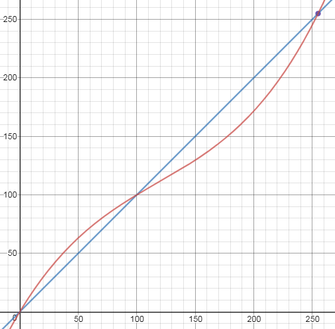
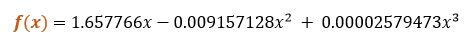
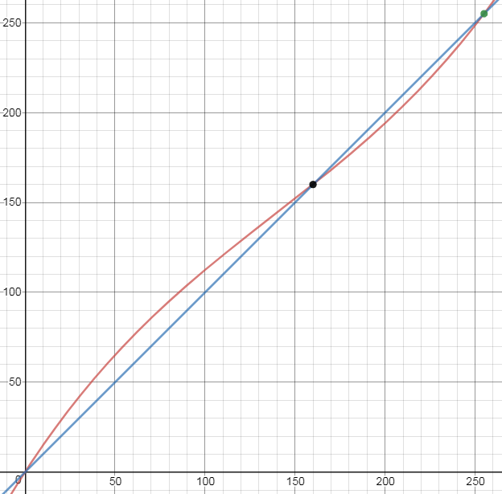
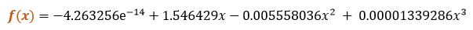

# **Glare Reduction** - Image Processing


Glare reduction is a step in Recovering glare images by Image processing method. You can use this at step: pre-processing data in CNN.

Glare reduction includes 3-mixed-filter by 4 steps:
1.	[Reduce-glare filter](#Reduce-glare-filter)
2.	Enhance contract: f = 1.6
3.	[Reduce-glare filter](#Reduce-glare-filter)
4.	Enhance contract: f = 1.4

```
    just run generate.py && show_case.py
```

More details at `Documentation.pdf`

## Custom Filters
### <a name="first-func"></a>1. First polynomial function:
For every pixel value within [0; 255], `First polynomial function` map it to another value so that: 
- The intensity with value less than 100 will increase.
- The intensity with value greater than 100 will decrease.

<div style="text-align:center">
    <br/>
    <i>Orange line<br/>x is original intensity<br/>y = f(x) is intensity after applying the first polynomial function</i>
</div>


`First polynomial function`'s expression:
<div style="text-align:center">
    
</div>

### <a name="second-func"></a>2. Second polynomial function:
For every pixel value within [0; 255], `Second polynomial function` map it to another value so that: 
- The intensity with value less than 160 will increase.
- The intensity with value greater than 160 will decrease.

<div style="text-align:center">
    <br/>
    <i>Orange line<br/>x is original intensity<br/>y = f(x) is intensity after applying the second polynomial function</i>
</div>


`Second polynomial function`'s expression:
<div style="text-align:center">
    
</div>

### <a name="Reduce-glare-filter"></a>3. Reduce-glare filter:
Include a 4-mixed-filter by 4 steps:
1. [First polynomial function](#first-func)
2. Gamma correction: g = 0.75
3. [Second polynomial function](#second-func)
4. Gamma correction: g = 0.8

